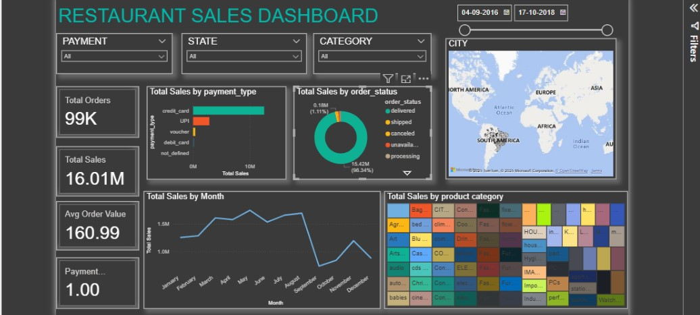

# Restaurant Performance Analysis – Operations, Sales & Profitability 
“Analysing restaurant performance and profitability to support strategic menu planning, resource allocation, and customer satisfaction using SQL, Python, and Power BI.”

## Table of Contents
 - [Oerview](#overview)
- [Business Problem](#business-problem)
- [Tools & Technologies](#tools--technologies)
- [Research Questions & Key Findings](#research-questions--key-findings)
- [Final & Reccomendation](#Final--Reccomendation)
- [Dashboard](#dashboard)
- [How to Run](#how-to-run)
- [Author](#author)

----
## Oerview

This project evaluates restaurant performance and operational dynamics to drive strategic insights for menu planning, pricing, and resource optimization. A complete data pipeline was built using SQL for ETL and Python for analysis.

## Business Problem

1. List all unique cities where customers are located.
2. Count the number of orders placed in 2017.
3. Find the total sales per category.
4. Calculate the percentage of orders that were paid in installments.
5. Count the number of customers from each state. 
6. Calculate the number of orders per month in 2018.
7. Find the average number of products per order, grouped by customer city.
8. Calculate the percentage of total revenue contributed by each product category.
9. Identify the correlation between product price and the number of times a product has been purchased.
10. Calculate the total revenue generated by each seller, and rank them by revenue.
11. Calculate the moving average of order values for each customer over their order history.
12. Calculate the cumulative sales per month for each year.
13. Calculate the year-over-year growth rate of total sales.
14. Calculate the retention rate of customers, defined as the percentage of customers who make another purchase within 6 months of their first purchase.
15. Identify the top 3 customers who spent the most money in each year.

## Tools & Technologies

- SQL  (Common table analysis, Filtering, Joins)
- Python (Pandas,Matplotlib,Seaborn)
- Github

## Research Questions & Key Findings

- **Top-selling items**: Certain menu categories/products generate the majority of revenue.

- **Customer segmentation**: High-value repeat customers contribute disproportionately to sales.

- **Payment preferences**: Digital wallets/credit card payments dominate, influencing loyalty program design.

- **Geographical insights**: Certain locations/geographies show higher average order values.

- **Profitability trends**: Some items drive volume but not profit (low-margin bestsellers).

## Dashboard

## Final & Reccomendation
-**Menu Optimization**

- Promote high-margin dishes through combos, upselling, and featured menu highlights.

- Drop/replace consistently low-performing items.

-**Personalized Marketing**

- Use customer order history to provide personalized offers.

- Create loyalty programs for repeat customers.

-**Dynamic Pricing**

- Adjust prices based on demand (e.g., peak hours, weekends).

- Offer discounts on low-demand days/times to smooth sales.

-**Delivery & Location Insights**

- Focus delivery marketing on high-order-value geographies.

- Partner with delivery apps for promotional boosts.

-**Improve Customer Retention**

- Introduce referral programs to bring in new customers.

- Improve feedback collection to identify service or food quality issues.

## How to Run

1. Clone the repository:

git https://github.com/simransaini0212-tech/restaurant-analysis-sql-python

2. Create Restaurant  summary tables:

python [restaurant_analysi](resturant_analysis.ipynb)

## Author 

**Simran Saini**

Data Analyst

Email - simransaini0212@gmail.com

linkedIn - https://www.linkedin.com/in/simran-saini-92a301369/
